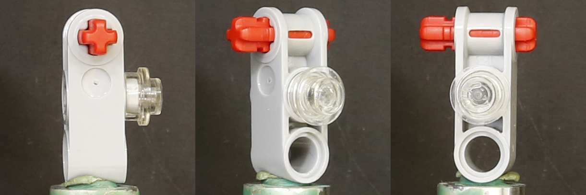
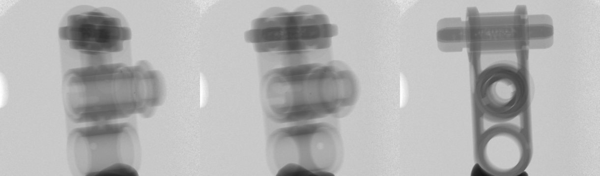
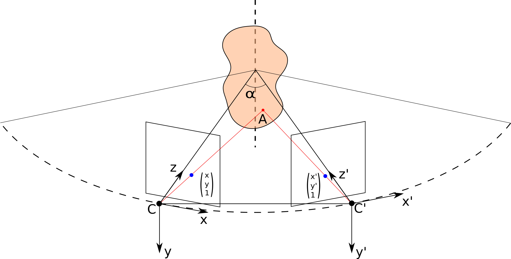

# X-ray and Visible Spectra Circular Motion Images Dataset

We present the collections of images of the same rotating plastic object made in X-ray and visible spectra. Both parts of the dataset contain 400 images. The images are maid every 0.5 degrees of the object axial rotation. The collection of images is designed for evaluation of the performance of circular motion estimation algorithms as well as for the study of X-ray nature influence on the image analysis algorithms such as keypoints detection and description.  

Details have been published in: [X-ray and Visible Spectra Circular Motion Images Dataset](https://arxiv.org/abs/1909.13730).

+ Images of the same object taken in X-ray and visible spectra.
+ The rotating object images are taken every 0.5 degrees.

If you use this dataset, please, cite the appropriate paper.

    @misc{chekanov2019xray,
        title={X-ray and Visible Spectra Circular Motion Images Dataset},
        author={Mikhail Chekanov and Oleg Shipitko},
        year={2019},
        eprint={1909.13730},
        archivePrefix={arXiv},
        primaryClass={eess.IV}
    }

## Image data

The dataset is organized as follows:
<pre>
xvcm_dataset/
├── xray/
│   ├── raw
│   │   ├── dark
│   │   ├── data
│   │   └── empty
│   ├── preprocessed
│   │   └── downscaled
│   └── calib
└── visible/
    ├── raw
    ├── preprocessed
    │   └── cropped
    └── calib
</pre>

## Data aqusition
The X-ray part of the dataset was collected at the X-ray microtomograph developed and operating at the Federal Research Center for Crystallography and Photonics of Russian Academy of Sciences with the following parameters:
+ exposure time -- 5 seconds;
+ radiation energy -- 17 keV;
+ monochromator -- pyrographite;
+ MoKa line. 

While recording data the camera was stationary. The optical axis of the camera was perpendicular to the axis of object rotation. Such system setup is equivalent to the case of the circular camera motion around a stationary object (see illsutration below).

## Data preprocessing

To compensate for X-ray detector noise the following prepossessing algorithm was applied:

where i, j - pixel coordinates, mean() - is the mean value of pixels in the given coordinates over the whole subfolder, three subfolders contain the following images:
+ `dark` - images taken in absence of X-ray radiation;
+ `empty` - images taken in absence of object;
+ `data` - images with rotating object.

Prerocessed images are stored in `xray/preprocessed`. See publication to 

Due to the Canon EOS 5D Mark III camera limitations object of interest occupies only a small part of visible images. Folder `visible/preprocessed/cropped` contains cropped images of the size 407 x 407 pixels. To make visible and X-ray images comparable the latest were downscaled to the comparable resolution (407 x 360 pixels) in a aspect ratio preserving way (folder `visible/preprocessed/cropped`).

## Calibration

Both parts of the dataset are accompanied by camera calibration parameters. In case of visible data, calibration was performed with the OpenCV toolbox by detecting chessboard pattern. Calibration parameters as well as images used for calibration are stored in `visible/calib` folder. In the case of X-ray data calibration was obtained by the known dimensions of the object were used to estimate camera calibration parameters. The calibration is stored at `xray/calib`.

## Download

**Full dataset**

[dataset](https://drive.google.com/drive/folders/1dz-6-dnDWiz3DAEvEqSJ0YPtVK9cUEsB?usp=sharing) `https://drive.google.com/drive/folders/1dz-6-dnDWiz3DAEvEqSJ0YPtVK9cUEsB?usp=sharing` 10.5 GB

**X-ray**

[raw images](https://drive.google.com/uc?export=download&id=1qbmgUdCWKH5woJEMl_4AQSEaT8oQKxJb) 6.7 GB

[preprocessed images](https://drive.google.com/uc?export=download&id=1nS7sxnwfr0OM-Ty2qqbdtbGSFFk08wat) 1.1 GB

[calibration](https://drive.google.com/uc?export=download&id=1ENReX9CjecmsY3j_2tBp9AngNPEYZ8xg) 221 B

**Visible**

[raw images](https://drive.google.com/uc?export=download&id=1nLDPoNNYADu2DkWg7sJ1oPJNLEqmY6SO) 2.6 GB

[preprocessed images](https://drive.google.com/uc?export=download&id=16SPVQByFNZmaGpPmLEMMu0JLsNIgnOwM) 15.4 MB

[calibration](https://drive.google.com/uc?export=download&id=1Vi-f6BKGuSHFoIA6grWBPLkf3Pzogc74) 94.3 MB

## Contribution

Contributions (bug reports, bug fixes, improvements, etc.) are very welcome and should be submitted in the form of new issues and/or pull requests on GitHub.

## License & citation  

Copyright 2019 Visillect Service LLC
Developed for Kharkevich Institute for Information Transmission Problems of the Russian Academy of Sciences (IITP RAS)

 Licensed under a <a rel="license" href="http://creativecommons.org/licenses/by-sa/4.0/">Creative Commons Attribution-ShareAlike 4.0 International License</a>
